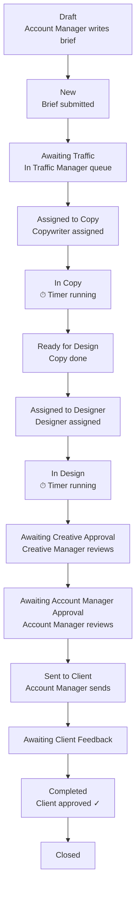

# Sunday — Product Design Document

**Product:** Sunday (Studio Workflow Management System)
**Type:** Multi-tenant SaaS platform · Web PWA
**Audience:** Advertising agencies and creative studios
**Last Updated:** March 2026

---

## 1. Executive Summary

Sunday is a **studio workflow management platform** purpose-built for **advertising agencies**. It replaces the ad-hoc mix of spreadsheets, email chains, and WhatsApp groups that agencies typically use to route creative work from brief to final delivery.

Every creative request — a social post, a print ad, a campaign landing page — follows a **structured approval path** through the agency: from the Account Manager who writes the brief, through the Traffic Manager who prioritises and assigns, through Copy and Design production, up through Creative Director and Account Manager approval gates, out to the client for feedback, and finally to completion.

Sunday models this entire lifecycle as a **configurable state machine**, layered on top of strict **role-based access control**, **real-time collaboration**, and **time tracking** to give agencies complete operational visibility.

The platform is **multi-tenant by design**: each agency is a fully isolated workspace with its own branding, users, clients, workflow rules, and SLA policies, accessed via a unique subdomain (`agency-slug.Sunday.app`).

---

## 2. Problem Statement

### The Pain

Advertising agencies (and creative studios worldwide) suffer from:

1. **No single source of truth** — Briefs arrive via email, WhatsApp, phone calls. There's no central place to see all active work.
2. **Opaque workload** — Traffic Managers can't see who's overloaded and who's free. Assignments are gut-feel.
3. **Lost handoffs** — Work passes between copywriter → designer → creative director → account manager, and context gets lost at every transition.
4. **No accountability on time** — Nobody knows how long tickets actually take. Pricing is guesswork.
5. **Approval bottlenecks** — Creative Directors or Account Managers sit on approvals with no visibility or alerts.
6. **Revision chaos** — Tickets bounce back and forth between designers and managers with no audit trail of how many rounds have passed.
7. **File version confusion** — Teams dig through Google Drive folders (or worse, email) to find the latest version.
8. **No client feedback loop** — Clients send feedback via email, and it gets lost or misattributed.

### The Solution

Sunday solves all of the above by giving every agency team member **one workspace** where:

- Every brief is structured, categorised, and tracked
- Every status change, assignment, and approval is logged
- Time is tracked per ticket, per role, automatically
- Files live in context (per ticket, versioned, via Google Drive)
- Communication happens in-context (ticket-level chat, @mentions)
- Everyone sees exactly what they need — and nothing they shouldn't

---

## 3. Target Users & Personas

### 3.1 Agency Admin (מנהל משרד)

> **"I need to see the big picture and make sure the machine is running."**

- Owner or managing director of the agency
- Configures the agency: users, roles, clients, workflow rules, SLA policies, hourly rates
- Assigns Account Managers to clients
- Has full visibility into all analytics, profitability, and audit logs
- Can configure Google Workspace integration
- Sets up custom fields, ticket types, brands, campaigns

**Key Screens:** Admin panel, Analytics dashboard, User management, Agency settings

---

### 3.2 Traffic Manager (מנהל טראפיק)

> **"I need to see all the work, know who's free, and keep things moving."**

- The operational heart of the agency
- Sees **all tickets** across all clients in the agency
- Prioritises the studio queue, assigns work to designers and copywriters
- Monitors SLA compliance — gets alerted when tickets are overdue
- Manages workload and capacity across the creative team
- Can perform bulk actions (reassign, reprioritise, hold, cancel)
- Monitors revision cycles and flags problematic tickets

**Key Screens:** Traffic Board (Kanban + Workload view), Ticket list, SLA dashboard

---

### 3.3 Creative Manager / Creative Director (מנהל קריאייטיב)

> **"I approve or reject every piece of creative that leaves the studio."**

- Reviews all creative output before it goes to the client
- Can approve, reject, or return work for revision
- Can request brief clarification from the Account Manager
- Can delegate approval rights temporarily (e.g., during vacation)
- Has read-only access to the traffic board
- Gets notified when revision count exceeds a threshold

**Key Screens:** Approval queue, Ticket detail (files tab), Traffic board (read-only)

---

### 3.4 Account Manager (מנהל לקוח)

> **"I own the client relationship. I write the brief, shepherd the work, and manage client expectations."**

- Linked to **specific clients** only (explicit Account Manager ↔ Client relationship)
- Writes and submits creative briefs
- Can only see tickets for their assigned clients
- Performs internal Account Manager approval before sending to client
- Sends finished work to client and collects feedback
- Can return tickets for revision if needed
- Opens recurring ticket configurations for retainer clients

**Key Screens:** Dashboard (my clients / my tickets), Ticket creation, Ticket detail

---

### 3.5 Designer (מעצב)

> **"Show me what I need to work on, let me track my time, and let me upload my files."**

- Sees **only tickets assigned to them**
- Must start/stop a timer when working (time tracking is mandatory)
- Can only have one active timer at a time — starting a new one auto-stops the previous
- Uploads design files to the ticket (via Google Drive integration)
- Marks tickets as ready for creative review when done
- Can chat on their assigned tickets
- Cannot see client lists, analytics, or other employees' work

**Key Screens:** My Tickets list, Ticket detail (brief, files, chat, timer), Live timer widget

---

### 3.6 Copywriter (קופי)

> **"Same as a designer, but for words."**

- Identical workflow to Designer, but works in the Copy phase
- Can work in parallel with designers (if parallel tracks are enabled on the ticket)
- Time tracking required
- Marks copy as ready for design or directly for creative review

**Key Screens:** Same as Designer

---

### 3.7 Media Buyer (קונה מדיה)

> **"I execute the media plan — ad placements, budgets, tracking."**

- Assigned to media tickets after creative is approved
- Works through a parallel media workflow: Assigned → In Media Work → Awaiting Media Review
- Time tracking required
- Sees only their assigned tickets

**Key Screens:** My Tickets, Ticket detail

---

### 3.8 Media Manager (מנהל מדיה)

> **"I review and approve media work before it goes live."**

- Reviews media work submitted by Media Buyers
- Approves or returns media work for revision
- Manages budget and campaign placement quality

**Key Screens:** Media review queue, Ticket detail

---

### 3.9 External User / Freelancer (חיצוני) — Phase 3

> **"I'm a contractor. Just show me what you need and I'll do it."**

- Sees only tickets directly assigned to them
- Time tracking required
- No access to client list, analytics, or other users' data
- No Google Workspace domain restriction (can log in from any Google account)

---

### 3.10 SuperAdmin (מנהל מערכת) — Platform Level

> **"I manage the platform itself — the agencies, the infrastructure."**

- Creates and manages agencies (tenants)
- Can activate/deactivate agencies
- Can impersonate any agency for support
- Sees aggregated platform-level statistics
- Accessed via `Sunday.app/admin`

**Key Screens:** Platform admin panel, Agency list, Platform stats

---

## 4. Core Concepts & Domain Model

### 4.1 The Organizational Hierarchy

```
Platform (Sunday.app)
  └── Agency (Tenant)                       e.g., "Gitam BBDO"
        ├── Business Units                  e.g., "Digital", "ATL"
        │     └── Clients                   e.g., "Coca-Cola Israel"
        │           └── Brands              e.g., "Coca-Cola Zero", "Fanta"
        │                 └── Campaigns     e.g., "Summer 2026 Launch"
        │                       └── Tickets e.g., "Facebook Hero Banner"
        ├── Users (with Roles)
        └── Ticket Types                    e.g., "Social Post", "Print Ad", "Video"
```

### 4.2 Key Entity Relationships

| Relationship                         | Description                                                                                                |
| ------------------------------------ | ---------------------------------------------------------------------------------------------------------- |
| **Agency → Users**                   | Every user belongs to exactly one agency. One-to-many.                                                     |
| **Account Manager ↔ Client**         | Explicit many-to-many. An Account Manager only sees tickets for clients they're linked to.                 |
| **Ticket → Client, Brand, Campaign** | Every ticket must belong to a client. Brand and Campaign are optional refinements.                         |
| **Ticket → Ticket Type**             | Determines workflow behaviour, SLA defaults, required stage gates, and custom fields.                      |
| **Ticket → Assignments**             | Multi-assignee: a ticket can have a copywriter, designer, media buyer, and Traffic Manager simultaneously. |
| **Ticket → Watchers**                | Read-only followers. Receive all notifications, can chat and upload files, but cannot take actions.        |
| **Ticket → Files**                   | Versioned. Stored in Google Drive. Can be marked as "final" or "client-facing".                            |
| **Ticket → Chat Messages**           | Threaded, with @mentions, file attachments, system messages, and decision records.                         |
| **Ticket → Work Sessiosn**            | Multiple users can log time. Only one active timer per user across all tickets.                            |
| **Ticket → Approvals**               | Typed: Creative, Media, Account Manager, Client. Each has its own status lifecycle.                        |
| **Ticket → Status History**          | Full audit trail of every status transition with who, when, and optional notes.                            |
| **Ticket → Status Duration Logs**    | How long the ticket spent in each status — used for analytics and SLA.                                     |

### 4.3 Ticket Types — Per-Agency Configurable

Ticket Types define the **kind of work** being done. Each agency can create and manage its own list:

| Example Ticket Type | Department | Description                         |
| ------------------- | ---------- | ----------------------------------- |
| Social Post         | Creative   | Single image/video for social media |
| Print Ad            | Creative   | High-res layout for press           |
| Presentation        | Creative   | Slide deck for client               |
| Video               | Creative   | Produced video content              |
| PPC Campaign        | Media      | Pay-per-click ad setup              |
| Social Ads          | Media      | Paid social placements              |

Each Ticket Type can define:

- **Default SLA hours** — how long this kind of work should take
- **Required stage gates** — which stages must be completed (linked to specific statuses)
- **Custom fields** — additional data capture specific to this work type
- **Department** — Creative or Media (determines which workflow path the ticket follows)

### 4.4 Custom Fields

Agencies can define custom data fields per Ticket Type or globally. Supported types:

- **Text** — Free-form text
- **Number** — Numeric input
- **Date** — Date picker
- **Select** — Dropdown single choice
- **Multi-select** — Dropdown multiple choice
- **Boolean** — Toggle/checkbox
- **URL** — Clickable link

Custom fields appear in the ticket detail view alongside the standard brief fields.

---

## 5. The Workflow — Status Machine

The core of Sunday is a **configurable state machine** that governs how every ticket moves through the agency. There are two main tracks — **Creative** and **Media** — which can run sequentially or in parallel.

### 5.1 Status Definitions

| Status                                | Hebrew                 | Meaning                                                                                   |
| ------------------------------------- | ---------------------- | ----------------------------------------------------------------------------------------- |
| **Draft**                             | טיוטה                  | Brief is being written by the Account Manager. Not yet submitted to the studio.           |
| **New**                               | חדש                    | Brief submitted, waiting to enter the traffic queue.                                      |
| **Awaiting Traffic**                  | ממתין לטראפיק          | In the traffic queue. Traffic Manager needs to review and assign.                         |
| **Awaiting Brief Completion**         | ממתין להשלמת בריף      | Traffic Manager flagged the brief as incomplete. Account Manager must fix.                |
| **Assigned to Copy**                  | הוקצה לקופי            | Copywriter assigned. Waiting for them to start.                                           |
| **In Copy**                           | בעבודת קופי            | Timer is running. Copywriter is actively working.                                         |
| **Ready for Design**                  | מוכן לעיצוב            | Copy is done. Waiting for Traffic Manager to assign a designer.                           |
| **Assigned to Designer**              | הוקצה למעצב            | Designer assigned. Waiting for them to start.                                             |
| **In Design**                         | בעיצוב                 | Timer is running. Designer is actively working.                                           |
| **Awaiting Creative Approval**        | ממתין לאישור קריאייטיב | Creative Manager must review and approve.                                                 |
| **Awaiting Brief Clarification**      | ממתין להבהרת בריף      | Creative Manager needs more information from the Account Manager.                         |
| **Return to Design**                  | חזר לתיקון עיצוב       | Creative Manager or Account Manager returned work to designer. Revision round increments. |
| **Return to Copy**                    | חזר לתיקון קופי        | Creative Manager returned work to copywriter. Revision round increments.                  |
| **Awaiting Account Manager Approval** | ממתין לאישור מנהל לקוח | Account Manager must approve internally before sending to client.                         |
| **Sent to Client**                    | נשלח ללקוח             | Account Manager sent the work to the external client.                                     |
| **Awaiting Client Feedback**          | ממתין לפידבק לקוח      | Waiting for client response.                                                              |
| **Return from Client**                | חזר מתיקוני לקוח       | Client requested changes. Goes back to production.                                        |
| **Assigned to Media**                 | הוקצה לקונה מדיה       | Media Buyer assigned for media execution.                                                 |
| **In Media Work**                     | בעבודת מדיה            | Timer running. Media Buyer actively working.                                              |
| **Awaiting Media Review**             | ממתין לאישור מנהל מדיה | Media Manager must review and approve media work.                                         |
| **Return to Media**                   | חזר לתיקון מדיה        | Media Manager returned to Media Buyer for revision.                                       |
| **Completed**                         | הושלם                  | Client approved. Work is done.                                                            |
| **Closed**                            | נסגר                   | Officially closed and archived.                                                           |
| **Cancelled**                         | בוטל                   | Ticket was cancelled.                                                                     |
| **On Hold**                           | מושהה                  | Paused. Can be resumed.                                                                   |

### 5.2 Happy-Path Flow



### 5.3 Revision & Return Flows

At multiple approval gates, work can be **returned for revision**:

| Approval Gate                        | Return Target                  | Effect                                       |
| ------------------------------------ | ------------------------------ | -------------------------------------------- |
| Creative Approval (Creative Manager) | Return to Design               | `revisionRound++`, timer restarts            |
| Creative Approval (Creative Manager) | Return to Copy                 | `revisionRound++`, timer restarts            |
| Account Manager Approval             | Return to Design or Copy       | Same as above                                |
| Client Feedback                      | Return from Client → re-assign | `revisionRound++`, Traffic Manager re-routes |
| Media Review                         | Return to Media                | `revisionRound++`, timer restarts            |

**Revision Alert Rule:** When `revisionRound` reaches a threshold (default: **3**), the system:

- Notifies the Traffic Manager and Creative Manager
- Shows a red exclamation badge on the ticket
- Adds the ticket to a "Needs Attention" section

### 5.4 Parallel Tracks

When a ticket has `parallelTracks = true`, Copy and Design phases run simultaneously instead of sequentially. This is an opt-in flag set at ticket creation.

### 5.5 Special Transitions

| Transition              | Who                                                        | When                                                                                        |
| ----------------------- | ---------------------------------------------------------- | ------------------------------------------------------------------------------------------- |
| **On Hold**             | Traffic Manager, Agency Admin                              | Pauses the ticket. All timers stop. SLA paused.                                             |
| **Cancelled**           | Account Manager (draft/new), Traffic Manager, Agency Admin | Removes from active workflow. Requires a note.                                              |
| **Brief Incomplete**    | Traffic Manager → Account Manager                          | Traffic Manager flags that the brief doesn't have enough info. Account Manager must revise. |
| **Brief Clarification** | Creative Manager → Account Manager                         | During creative review, Creative Manager needs more context from the Account Manager.       |

### 5.6 Workflow Rules Engine

Each transition is governed by a **Workflow Rule** record that defines:

- **Who** can perform it (allowed roles)
- **What's required** — mandatory note, mandatory file upload, next assignee
- **Side effects** — auto-stop timer, increment revision round, reset SLA clock
- **Who gets notified** — configurable notification targets

Default rules are seeded for every new agency. The **Agency Admin can customise** transition rules per agency — adding constraints, changing who's allowed, or adjusting notification targets.

---

## 6. Feature Inventory — Screen by Screen

### 6.1 Authentication & Onboarding

| Feature                    | Description                                                                                                                                   |
| -------------------------- | --------------------------------------------------------------------------------------------------------------------------------------------- |
| **Google OAuth login**     | Users log in with their Google account. No passwords to manage.                                                                               |
| **Domain restriction**     | Each agency can restrict login to their Google Workspace domain (e.g., only `@gitam.co.il` can log in). External/freelancer users are exempt. |
| **Auto user provisioning** | First login creates the user profile. Admin assigns the role.                                                                                 |
| **Session management**     | Configurable session duration. Automatic refresh.                                                                                             |

---

### 6.2 Dashboard (Per-Role Home Screen)

Each role sees a different dashboard tailored to their needs:

| Role                      | Dashboard Content                                                            |
| ------------------------- | ---------------------------------------------------------------------------- |
| **Traffic Manager**       | Unassigned tickets, SLA alerts, workload heat map, tickets needing attention |
| **Creative Manager**      | Pending approvals, revision alerts, recently completed                       |
| **Account Manager**       | My clients' active tickets, tickets awaiting my action, overdue tickets      |
| **Designer / Copywriter** | My assigned tickets, active timer, upcoming deadlines                        |
| **Agency Admin**          | Key metrics, team utilisation, SLA compliance overview                       |

---

### 6.3 Traffic Board

The Traffic Board is the **command centre** for the Traffic Manager:

| View              | Description                                                                                  |
| ----------------- | -------------------------------------------------------------------------------------------- |
| **Kanban Board**  | Tickets as cards, grouped by status columns. Drag-and-drop to reassign or change priority.   |
| **Workload View** | Team members as rows, tickets as blocks. Visualises who's overloaded and who has capacity.   |
| **Filters**       | By client, brand, campaign, priority, deadline range, ticket type, assignee, status          |
| **Bulk Actions**  | Select multiple tickets → reassign, change priority, hold, cancel                            |
| **Saved Views**   | Save filter combinations for quick recall (e.g., "Urgent Design Tickets", "Client X Active") |

**Who can access:**

- Full access (drag-and-drop): Traffic Manager, Agency Admin
- Read-only: Creative Manager
- No access: Account Manager, Designer, Copywriter, External

---

### 6.4 Ticket Creation (Brief Form)

The Account Manager (or Traffic Manager, Agency Admin) creates a ticket with the following information:

| Field             | Required | Description                                    |
| ----------------- | -------- | ---------------------------------------------- |
| Title             | ✓        | Short descriptive name                         |
| Client            | ✓        | Select from assigned clients                   |
| Brand             | —        | Under the selected client                      |
| Campaign          | —        | Under the selected brand                       |
| Ticket Type       | ✓        | Determines workflow path and custom fields     |
| Brief             | —        | Rich text description of the work              |
| Priority          | ✓        | Low / Normal / High / Urgent / Critical        |
| Deadline          | —        | External client deadline                       |
| Internal Deadline | —        | Agency's internal deadline (typically earlier) |
| Parallel Tracks   | —        | Enable simultaneous copy + design              |
| Quoted Price      | —        | Estimated cost for the client                  |
| Tags              | —        | Free-form labels                               |
| Custom Fields     | varies   | Based on the selected Ticket Type              |
| Watchers          | —        | Add people who should follow this ticket       |

**Ticket Number:** Auto-generated per agency (e.g., `Sunday-0042`).

---

### 6.5 Ticket Detail View

The ticket detail view is organised in **tabs**:

#### Brief Tab

- Full brief text with formatting.
- Ticket metadata: client, brand, campaign, type, priority, deadlines, quoted price.
- Custom field values.
- Handoff note from Traffic Manager (displayed as a banner to the assignee).

#### Status & History Tab

- Current status with colour badge.
- Visual timeline showing every transition with who, when, and notes.
- Status duration breakdown: how long the ticket has spent in each phase.
- Approval history: every approval decision with reviewer, timestamp, and reason.

#### Team & Assignments Tab

- Current and past assignees by role (copywriter, designer, media buyer, Traffic Manager, Creative Manager).
- Watchers list (add/remove).
- Account Manager for this client.

#### Files Tab

- All files attached to the ticket, with version numbers.
- Files sourced from: Google Drive (via Picker), direct upload, or URL link.
- Metadata: file type, size, uploader, upload date.
- Flags: "Final" (this is the approved version), "Client-Facing" (safe to show client).
- Google Drive integration: auto-created folder per ticket in the agency's Shared Drive.

#### Chat Tab

- Real-time messaging (via WebSocket).
- @mentions that trigger notifications.
- Reply threading (quote-reply to a specific message).
- File attachments within messages.
- System messages: auto-generated when status changes, approvals happen, or files are uploaded.
- Decision messages: special type marking a formal decision (approval, rejection).

#### Time Tab

- All Work Sessiosn on this ticket, from all assignees.
- Aggregated total time by role.
- Start/Stop timer button (for eligible roles).
- Visibility: Designers see their own time. Traffic Manager / Creative Manager / Admin see all time. Account Manager sees total only.

#### Actions Sidebar

The right side of the ticket detail shows available **actions** based on the current status and the user's role, e.g.:

- "Assign to Designer" (Traffic Manager, when status is Ready for Design)
- "Mark Ready for Review" (Designer, when status is In Design)
- "Approve" / "Reject" / "Return for Revision" (Creative Manager, when awaiting creative approval)
- "Send to Client" (Account Manager, when awaiting Account Manager approval)

---

### 6.6 Time Tracking

| Feature                     | Description                                                                                 |
| --------------------------- | ------------------------------------------------------------------------------------------- |
| **Live Timer Widget**       | Persistent floating widget showing the active timer (ticket name, elapsed time).            |
| **One Timer Rule**          | Users can only have one active timer at a time. Starting a new one auto-stops the previous. |
| **Auto-Stop on Transition** | Moving a ticket out of In Copy / In Design / In Media Work auto-stops the timer.            |
| **Timer-Eligible Roles**    | Only Designer, Copywriter, Media Buyer, and External can track time.                        |
| **Time Entry Notes**        | Optional notes on each entry.                                                               |
| **Admin Editing**           | Agency Admin can edit Work Sessiosn (correct mistakes).                                      |
| **Real-Time Sync**          | Timer state broadcasts live so the Traffic Board shows who's actively working.              |

---

### 6.7 Approval System

Approvals are **typed** and follow different gates:

| Approval Type       | Who Reviews                              | When                                      |
| ------------------- | ---------------------------------------- | ----------------------------------------- |
| **Creative**        | Creative Manager (or delegatee)          | After design/copy is submitted for review |
| **Media**           | Media Manager                            | After media work is submitted             |
| **Account Manager** | The Account Manager linked to the client | After creative approval passes            |
| **Client**          | (External — logged by Account Manager)   | After Account Manager sends to client     |

**Approval Delegation:**

- Creative Managers and Account Managers can delegate their approval authority to another user for a date range
- Useful for vacations, sick days, or team handoffs
- All delegated actions are logged with both the delegate's identity and on whose behalf they acted
- The original delegator still receives notifications

---

### 6.8 Notifications System

#### Channels

| Channel      | Description                                                     |
| ------------ | --------------------------------------------------------------- |
| **In-App**   | Real-time bell icon with dropdown list, delivered via WebSocket |
| **Email**    | Via configurable SMTP provider                                  |
| **Web Push** | Browser push notifications via Service Workers                  |

#### Triggering Events

- New ticket assigned to me
- My ticket changed status
- I was @mentioned in chat
- Ticket returned to me for revision
- Pending approval waiting for me
- Ticket overdue (SLA breach)
- New file uploaded on my ticket
- My delegation was created or expired

#### User Preferences

- **Do Not Disturb** — set quiet hours (e.g., 22:00–08:00)
- **Frequency** — Immediate / Daily Digest / Weekly Digest / Off
- **Weekly Digest** — Summary delivered on a configurable day and time (timezone-aware per agency)

---

### 6.9 SLA Management

| Stage                            | Default SLA |
| -------------------------------- | ----------- |
| Brief → Traffic assignment       | 4 hours     |
| Traffic → Copy/Design assignment | 2 hours     |
| Copy work                        | 24 hours    |
| Design work                      | 48 hours    |
| Creative approval                | 8 hours     |
| Account Manager approval         | 4 hours     |
| Client feedback                  | 72 hours    |
| Media work                       | 48 hours    |
| Media review                     | 8 hours     |

**All SLA thresholds are configurable per agency by the Agency Admin.**

**On breach:**

- Ticket card turns red on the traffic board
- Notification sent to Traffic Manager and the breaching role's direct manager
- Ticket surfaces in "Needs Attention" dashboard section

**SLA pauses:**

- When a ticket goes On Hold, the SLA timer pauses
- When it resumes, the clock continues from where it left off
- SLA can optionally reset on certain transitions (configurable per workflow rule)

---

### 6.10 Analytics

#### Agency-Level Dashboard

- Total tickets created / completed / overdue this period
- Average completion time
- SLA compliance rate
- Revision rate (average revision rounds per ticket)

#### Per-Client Analytics

- Total tickets and completion rate
- Total hours billed
- Average turnaround time
- Revision rate per client
- **Profitability** (Phase 3): Quoted price vs actual cost (hours × hourly rates)

#### Per-Employee Analytics

- Hours logged this week / month
- Tickets completed
- Personal revision rate
- Top clients by time spent
- Utilisation rate

#### Personal Stats (Phase 3)

- Self-service analytics tab in the user's own profile
- Personal trends, averages, and benchmarks

**Access Control:**

- Agency Admin + Traffic Manager: Full agency analytics + employee + client
- Creative Manager: Agency and client analytics
- Account Manager: Only analytics for their own clients
- Designers / Copywriters: Personal stats only (Phase 3)

---

### 6.11 Client & Organisational Management

#### Business Units

Agencies can organise clients into Business Units (e.g., "Digital", "ATL", "Pharma"). Each unit can have a manager and its own logo.

#### Clients

- Name, logo, contact details
- Linked to a Business Unit (optional)
- Multiple Account Managers can be assigned (with a primary Account Manager flag)

#### Brands

Under each client. Each brand can have:

- Logo
- Brand guidelines text

#### Campaigns

Under each brand. Each campaign can have:

- Description, date range (start/end)
- Quoted price and currency

---

### 6.12 User & Role Management

#### Invitation Flow

1. Agency Admin invites user by email
2. User logs in via Google OAuth
3. Admin assigns role

#### Role Configuration

Each agency has a configurable set of roles:

- Standard roles are seeded by default
- Admin can customise display names, descriptions, colours
- Admin can create custom roles based on a base role
- Each role has a set of permissions (granular permission keys)

#### Availability Management

- Users can be marked as unavailable (with date range)
- Traffic Manager can set user availability
- Unavailable users are excluded from assignment suggestions

#### User Skills (Phase 3)

Users can be tagged with skill types: Video, Print, Digital, Social, Illustration, Motion, Copywriting, PPC, SEM, Social Ads, Programmatic. Used for smart assignment suggestions.

---

### 6.13 Recurring Tickets

For retainer clients with repetitive deliverables:

| Setting               | Description                                                        |
| --------------------- | ------------------------------------------------------------------ |
| **Template**          | Title, brief, client, brand, campaign, ticket type, priority, tags |
| **Recurrence**        | Weekly, Biweekly, or Monthly                                       |
| **Schedule**          | Day of week (for weekly/biweekly) or day of month                  |
| **Deadline Offset**   | Auto-set deadline N days after creation                            |
| **End Condition**     | End date or max occurrences                                        |
| **Clone Assignments** | Optionally pre-assign the same team                                |
| **Clone Watchers**    | Optionally carry over watchers                                     |

The system automatically creates tickets from these templates on schedule.

---

### 6.14 Admin Panel (SuperAdmin)

The platform-level admin (accessed at `Sunday.app/admin`):

| Feature               | Description                                                    |
| --------------------- | -------------------------------------------------------------- |
| **Agency Management** | Create, edit, activate, deactivate agencies                    |
| **Impersonation**     | Log in as any agency to troubleshoot                           |
| **Platform Stats**    | Total agencies, total users, total tickets across the platform |
| **Agency Plans**      | Free, Pro, Enterprise tiers                                    |

---

### 6.15 Audit Log

Every significant action is logged:

- Who performed it
- What entity was affected (ticket, client, user, etc.)
- What changed (old value → new value)
- When it happened
- IP address and user agent

Only visible to Agency Admin and SuperAdmin.

---

### 6.16 Chat & In-Context Communication

Chat is **per-ticket**, not a standalone messaging system. This keeps all communication in context.

| Feature               | Description                                                     |
| --------------------- | --------------------------------------------------------------- |
| **Real-time**         | Messages appear instantly via WebSocket                         |
| **@Mentions**         | Tag team members, triggers notification                         |
| **Replies**           | Thread-style reply to any message                               |
| **File Attachments**  | Attach files directly in chat messages                          |
| **System Messages**   | Auto-generated on status changes, approvals, file uploads       |
| **Decision Messages** | Formal approval/rejection records displayed prominently         |
| **Edit / Delete**     | Users can edit/delete their own messages. Admin can delete any. |

---

### 6.17 Files & Google Drive Integration

| Feature                 | Description                                                                  |
| ----------------------- | ---------------------------------------------------------------------------- |
| **Auto-Folder**         | System creates a Google Drive folder per ticket in the agency's Shared Drive |
| **Google Picker**       | In-app file picker to select or upload from Google Drive                     |
| **Version Tracking**    | Files have a version number, incremented on re-upload                        |
| **Source Types**        | Google Drive, Direct Upload, URL Link                                        |
| **Flags**               | "Final" (approved version), "Client-Facing" (shareable with client)          |
| **Max File Size**       | 50 MB per file                                                               |
| **Drive Notifications** | Push notifications from Google Drive when files change                       |

---

## 7. Multi-Tenancy Model

| Aspect                    | Description                                                                                     |
| ------------------------- | ----------------------------------------------------------------------------------------------- |
| **Isolation**             | Each agency is a fully isolated tenant. No data bleeds between agencies.                        |
| **Subdomain Routing**     | Each agency has a unique slug: `{slug}.Sunday.app`                                              |
| **Google Workspace Lock** | Optionally restrict login to users from the agency's domain                                     |
| **Branding**              | Custom logo and primary colour per agency                                                       |
| **Configuration**         | Workflow rules, SLA policies, ticket types, custom fields, roles, hourly rates — all per-agency |
| **Plans**                 | Free, Pro, Enterprise — feature gating per plan                                                 |

---

## 8. Localisation & Accessibility

All localisation settings are **fully configurable** per agency and per user. Sunday is not hard-coded to any specific language, currency, or text direction.

| Setting                        | Scope                                | Description                                                                                                                                                                                                                                    |
| ------------------------------ | ------------------------------------ | ---------------------------------------------------------------------------------------------------------------------------------------------------------------------------------------------------------------------------------------------- |
| **Interface Language**         | Per user                             | Each user selects their preferred language. The platform supports any number of languages; Hebrew and English are included out of the box.                                                                                                     |
| **Text Direction (RTL / LTR)** | Automatic per language               | The UI automatically switches between right-to-left and left-to-right layout based on the active language.                                                                                                                                     |
| **Default Language**           | Per agency                           | The Agency Admin sets the default language for the agency. New users inherit this default.                                                                                                                                                     |
| **Currency**                   | Per agency, per campaign, per ticket | A default currency is set at the agency level (e.g., ILS, USD, EUR). Campaigns and individual tickets can override with a different currency.                                                                                                  |
| **Timezone**                   | Per agency                           | All timestamps, SLA clocks, digest schedules, and date displays are timezone-aware. The Agency Admin configures the agency's timezone.                                                                                                         |
| **Date Format**                | Per locale                           | Dates are formatted according to the user's locale conventions.                                                                                                                                                                                |
| **Bilingual Data**             | System-wide                          | All system entities that have display labels — Ticket Types, status names, stage gate names, custom field labels — store both a primary-language and an English value. The UI renders the correct one based on the user's language preference. |
| **Mobile-First**               | —                                    | Responsive PWA design. Installable on mobile home screens.                                                                                                                                                                                     |
| **Offline Support**            | —                                    | Service Worker provides basic offline capabilities and background sync.                                                                                                                                                                        |

---

## 9. Real-Time Features

| Feature                   | Description                                               |
| ------------------------- | --------------------------------------------------------- |
| **Chat Messages**         | Delivered instantly via WebSocket                         |
| **Timer Sync**            | Active timers broadcast to the Traffic Board in real-time |
| **Notification Bell**     | Unread count updates live                                 |
| **Ticket Status Updates** | Board auto-refreshes when tickets transition              |
| **Agency-Wide Events**    | Broadcast updates to all connected users in the agency    |

---

## 10. Phased Roadmap

### Phase 1 — MVP

- Multi-tenancy + agency onboarding
- Google OAuth2 login
- Role-based access control + Account Manager ↔ Client linking + Ticket Watchers
- Clients / Brands / Campaigns / Business Units
- Full ticket brief + creative workflow status machine
- Traffic Board (Kanban + Workload)
- Ticket detail with all tabs (brief, status, team, files, chat, time)
- Time tracking (start/stop, live timer widget)
- Google Drive integration (auto-folder, Picker, versioned files)
- Chat with @mentions, replies, attachments
- Notifications (in-app, email, push)
- SLA policies and breach alerts
- Audit log
- Basic analytics (agency, client, employee)
- Media department workflow (parallel to creative)
- Configurable localisation (language, text direction, currency, timezone)
- PWA + mobile responsive
- Recurring ticket templates

### Phase 2

- Clone Ticket
- Bulk Invite Users
- Approval Delegation (Creative Manager / Account Manager vacation coverage)
- Saved Views (reusable filter presets)
- Status Duration Logging + analytics
- Weekly Digest notifications
- Bulk Actions on traffic board

### Phase 3

- External Users / Freelancers
- User Skills (for smart assignment)
- Quoted Price + Actual Cost → Margin / Profitability analytics
- Personal Stats (self-service analytics for creatives)
- Parallel Tracks (simultaneous copy + design)
- Client Portal (external client access for feedback)

### Phase 4 (Future)

- Media planning module
- Finance / Invoicing integration
- Retainer management
- Full CRM capabilities
- BI reports and data export
